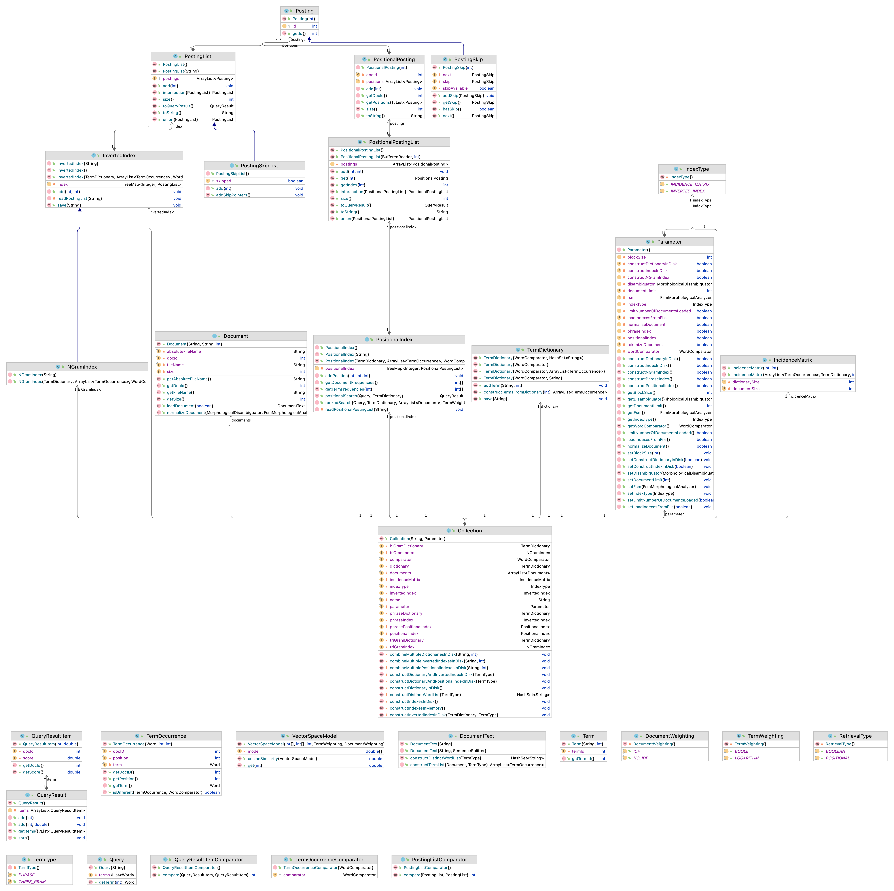

Information Retrieval
============

Video Lectures
============

Class Diagram
============

For Developers
============

## Requirements

* [Java Development Kit 8 or higher](#java), Open JDK or Oracle JDK
* [Maven](#maven)
* [Git](#git)

### Java 

To check if you have a compatible version of Java installed, use the following command:

    java -version
    
If you don't have a compatible version, you can download either [Oracle JDK](https://www.oracle.com/technetwork/java/javase/downloads/jdk8-downloads-2133151.html) or [OpenJDK](https://openjdk.java.net/install/)    

### Maven
To check if you have Maven installed, use the following command:

    mvn --version
    
To install Maven, you can follow the instructions [here](https://maven.apache.org/install.html).      

### Git

Install the [latest version of Git](https://git-scm.com/book/en/v2/Getting-Started-Installing-Git).

## Download Code

In order to work on code, create a fork from GitHub page. 
Use Git for cloning the code to your local or below line for Ubuntu:

	git clone <your-fork-git-link>

A directory called InformationRetrieval will be created. Or you can use below link for exploring the code:

	git clone https://github.com/starlangsoftware/InformationRetrieval.git

## Open project with IntelliJ IDEA

Steps for opening the cloned project:

* Start IDE
* Select **File | Open** from main menu
* Choose `InformationRetrieval/pom.xml` file
* Select open as project option
* Couple of seconds, dependencies with Maven will be downloaded. 

## Compile

**From IDE**

After being done with the downloading and Maven indexing, select **Build Project** option from **Build** menu. After compilation process, user can run InformationRetrieval.

**From Console**

Go to `InformationRetrieval` directory and compile with 

     mvn compile 

## Generating jar files

**From IDE**

Use `package` of 'Lifecycle' from maven window on the right and from `InformationRetrieval` root module.

**From Console**

Use below line to generate jar file:

     mvn install

## Maven Usage

        <dependency>
            <groupId>io.github.starlangsoftware</groupId>
            <artifactId>InformationRetrieval</artifactId>
            <version>1.0.0</version>
        </dependency>

